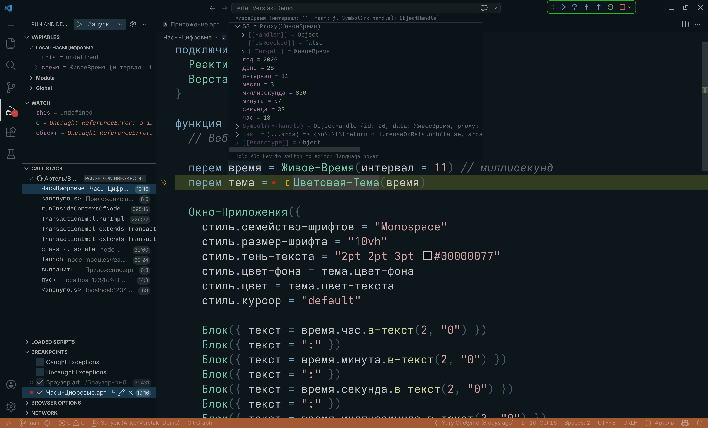

## Артель + Верстак + Реактроник: демонстрация возможностей

Для запуска требуются:

- NodeJS 20+ ([ссылка](https://nodejs.org/)).

Для комфортного редактирования исходного кода с
подсветкой синтаксиса, подсказками и отладчиком
требуются:

- Visual Studio Code 1.95+ ([ссылка](https://code.visualstudio.com/)).
- Расширение Артель для VS Code 0.9.26019+ ([ссылка](https://marketplace.visualstudio.com/items?itemName=nezaboodka.artel-vscode))

Для запуска приложения нужно скачать требуемые
NPM-пакеты, выполнив в командной строке:

``` shell
npm run скачать-пакеты
```

Далее выполнить компиляцию (сборку) проекта:

``` shell
npm run собрать-приложение
```

И запустить локальный веб-сервер для хостинга файлов
собранного приложения:

``` shell
npm run запустить-сервер
```

После запуска веб-сервера приложение можно открыть в
браузере:

- http://localhost:1234

При внесении изменений в исходный код нужно вручную
перекомпилировать проект с помощью команды
`npm run собрать-приложение`. После выполнения этой
команды веб-сервер подхватит новую версию приложения.

В настоящий момент открывать проект в VS Code для
навигации, редактирования и отладки нужно после
установки NPM-пакетов, поскольку отключено слежение
за изменениями в папке "node_modules" со стороны
расширения Артель. Это также значит, что при
переустановке NPM-пакетов нужно перезапустить VS Code.

При запуске приложения из VS Code в отладочном режиме
(Debug and Run > Запуск) будут работать точки отладки
(breakpoints), пошаговое выполнение и т.д.


